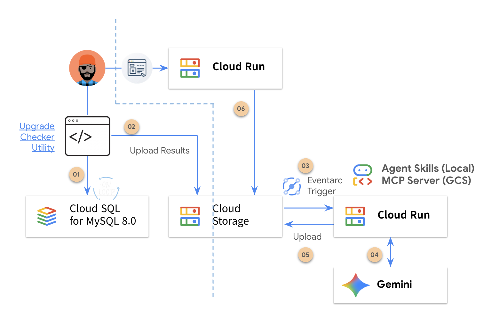
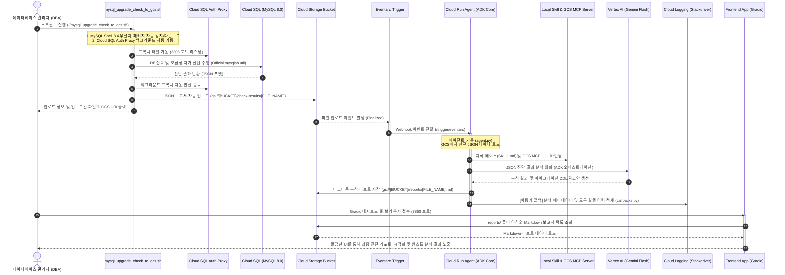

> [!WARNING]
> **Disclaimer** : This project is a demo-purpose codebase developed for technical validation and Proof of Concept (PoC) purposes. Google Cloud does not officially support or guarantee its behavior in production environments. It is highly recommended to conduct thorough validation and isolated testing.


# 📊 Cloud SQL for MySQL 8.4 Upgrade Compatibility Checker Agent

**MySQL 8.0에서 MySQL 8.4 LTS(Long-Term Support) 버전으로의 안전하고 끊김 없는 마이그레이션을 지원하기 위해 설계된 호환성 자가진단 및 AI 에이전트 기반 리포팅 자동화 시스템입니다.**

본 솔루션은 Google Cloud Platform(GCP) Cloud SQL 관리형 데이터베이스 환경의 인프라 제약과 MySQL 8.4 공식 사양을 정밀하게 분석하여 마이그레이션 도중 발생할 수 있는 잠재적 장애 요소를 원천 차단합니다. 

데이터베이스 관리자(DBA)가 클라이언트용 스크립트 실행만으로 진단을 완료하면, **이벤트 기반 아키텍처(Event-Driven Architecture)**를 타고 GCS 버킷에 적재된 진단 결과를 AI 에이전트가 탐색합니다. 이후 **Google Agent Development Kit(ADK)**과 **Gemini**가 결합되어 조치 가능한 완벽한 형태의 마이그레이션 DDL과 권고안을 Markdown 리포트로 자동 생성해 줍니다. 최종적으로, 사용자는 미려하게 다듬어진 **Gradio 웹 대시보드**를 통해 생성된 보고서를 시각적으로 간편하게 조회 및 분석할 수 있습니다.

---

## 🏗️ 시스템 아키텍처 및 흐름 (Architecture Flow)

<p align="center">
  
</p>



---

## 🔑 환경 변수 구성 (`.env` 가이드)

`.env.template` 파일을 복사하여 `.env` 파일을 생성한 후 설정을 채우십시오.

```bash
# ==============================================================================
# 1. Google Cloud 인프라 기본 환경 설정
# ==============================================================================
GOOGLE_CLOUD_PROJECT="your-gcp-project-id"       # 대상 구글 클라우드 프로젝트 ID
GOOGLE_CLOUD_LOCATION="global"                 # GCP API 엔드포인트 위치
GOOGLE_GENAI_USE_VERTEXAI=TRUE                 # Vertex AI Gemini 모델 기동 플래그

# ==============================================================================
# 2. ADK 텔레메트리 및 관측 가능성 (Observability)
# ==============================================================================
GOOGLE_CLOUD_AGENT_ENGINE_ENABLE_TELEMETRY=true
OTEL_SEMCONV_STABILITY_OPT_IN="gen_ai_latest_experimental"
OTEL_INSTRUMENTATION_GENAI_CAPTURE_MESSAGE_CONTENT=EVENT_ONLY

# ==============================================================================
# 3. Model Context Protocol (MCP) 연동
# ==============================================================================
# GCS 연동 기능을 대행해주는 GCP MCP 서버 식별자 정보 (From : Agent Registry)
GCS_MCP_SERVER="projects/your-gcp-project-id/locations/global/mcpServers/your-mcp-server-id"

# ==============================================================================
# 4. 배포용 스토리지 및 인프라 서비스 정보
# ==============================================================================
STAGING_BUCKET_URI="gs://your-upgrade-checker-bucket" # 진단 JSON 결과가 수집될 GCS 버킷 URI (gs:// 접두사 포함)
GCP_RESOURCES_LOCATION="us-central1"                  # Cloud Run 서비스 및 인프라가 배포될 GCP 리전
```
---


### 📦 [Infra] AI Agent 및 Frontend 를 Cloud Run 에 배포, Eventarc 파이프라인 설정

전체 에이전트 애플리케이션 및 리포트 시각화 대시보드를 GCP 클라우드에 원클릭으로 간편 배포합니다.

```bash
# 1. 배포 스크립트 실행 권한 부여
chmod +x ./deploy.sh

# 2. 인프라 배포 실행 (빌드, 전용 SA 생성, IAM 권한 바인딩, Cloud Run 및 Eventarc 프로비저닝 수행)
./deploy.sh
```

---

## 🛠️ 사용법 및 가이드 (How to Use)

### 🚀 [Client] 배스천 및 로컬 DB 머신에서의 진단 실행

로컬 데이터베이스 접속 장비 또는 배스천 인프라 머신에서 호환성 진단을 원스톱으로 수행하고 GCS로의 결과 파일 업로드까지 자동 완성합니다.

```bash
# 1. 파일 열기 후 상단의 단 두 가지 '필수 값' 설정
# INSTANCE_CONNECTION_NAME="프로젝트-ID:리전:인스턴스-명"
# GCS_BUCKET=""
vi mysql_upgrade_check_to_gcs.sh

# 2. 실행 권한 부여
chmod +x ./mysql_upgrade_check_to_gcs.sh

# 3. 업그레이드 체커 구동
./mysql_upgrade_check_to_gcs.sh
```

---

## 🔗 참고 문헌 및 가이드 (References)

* **MySQL 공식 가이드 (Oracle)**:
  * [MySQL 8.4 LTS - Upgrading from a Previous Series](https://dev.mysql.com/doc/refman/8.4/en/upgrading-from-previous-series.html)
  * [MySQL Shell 8.4 - Server Upgrade Checker Utility](https://dev.mysql.com/doc/mysql-shell/8.4/en/mysql-shell-utilities-upgrade.html)
* **GCP Cloud SQL 공식 가이드 (Google Cloud)**:
  * [Cloud SQL for MySQL - Upgrade the major database version in-place](https://docs.cloud.google.com/sql/docs/mysql/upgrade-major-db-version-inplace)
  * [Cloud SQL for MySQL - Best Practices](https://docs.cloud.google.com/sql/docs/mysql/best-practices)
