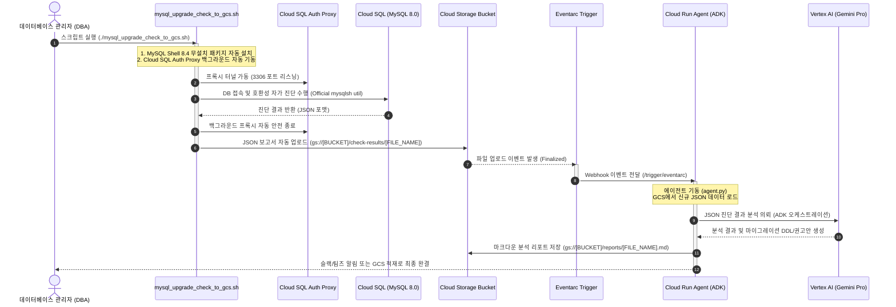

# 📊 Cloud SQL for MySQL 8.4 Upgrade Compatibility Checker

**MySQL 8.0에서 MySQL 8.4 LTS(Long-Term Support) 버전으로의 안전한 마이그레이션을 위한 호환성 진단 및 이벤트 기반 자동 분석 에이전트 시스템입니다.**

본 시스템은 GCP Cloud SQL 관리형 데이터베이스의 고유한 인프라 제약 조건과 MySQL 8.4의 최신 호환성 사양을 정밀하게 분석합니다. 데이터베이스 관리자(DBA)가 수동으로 점검을 수행할 수도 있으며, **이벤트 기반 아키텍처(Event-driven Architecture)**를 통해 GCS에 업로드된 검사 리포트를 AI Agent가 자동으로 인지하여 고도화된 정밀 분석 및 마이그레이션 권고안을 마크다운 리포트로 출력해 줍니다.

---


---

## 🏗️ 시스템 아키텍처 및 흐름 (Architecture Flow)


이벤트 기반 호환성 진단 및 리포팅 자동화 파이프라인의 핵심 흐름은 다음과 같습니다.



---

## 📁 디렉토리 구조 (Directory Structure)

에이전트 핵심 구동부와 인프라 배포 자동화, 배스천용 클라이언트 스크립트가 다음과 같이 정밀하게 일원화되어 구성되어 있습니다.

```text
mysql-84-upgrade-checker/
├── README.md                           # [본 파일] 프로젝트 개요 및 전체 구성 가이드 (국문)
├── .env                                # 프로젝트 로컬 구동 및 배포 시 참조되는 핵심 환경변수 프로필
├── requirements.txt                    # 에이전트 구동 및 SDK 의존성 명세서
├── Dockerfile                          # Cloud Run 배포용 경량 멀티스테이지 컨테이너 이미지 빌드 시트
├── agent.py                            # Vertex AI & Cloud Storage를 제어하는 ADK AI 에이전트 소스코드
├── deploy.sh                           # 전용 SA 및 IAM 권한 자동 부여 기능이 포함된 배포 완전 자동화 스크립트
├── mysql_upgrade_check_to_gcs.sh       # 배스천/DB 접속 로컬 장비에서 구동하는 무설치 원스톱 업그레이드 체커
└── skill/                              # 에이전트 스킬 핵심 패키지 폴더
    ├── SKILL.md                        # 에이전트 실행 지침 및 핵심 호환성 체크리스트 (영문 표준)
    └── scripts/
        ├── check_compatibility.py      # 무의존성 초경량 자가 진단 스크립트 (Python, PyMySQL)
        └── remediate_users.py          # 레거시 유저 인증 플러그인 변경 DDL 생성 도구
```

---

## 🔑 환경 변수 구성 (`.env` 가이드)

배포 자동화(`deploy.sh`) 및 에이전트 구동(`agent.py`)에 필수적으로 사용되는 변수 정보들입니다. 기밀이 유지되어야 하는 로컬의 `.env` 파일에 지정하여 안전하게 로드됩니다.

```bash
# GCP 핵심 인프라 설정
GOOGLE_CLOUD_PROJECT="gcp-sandbox-kwlee"  # 대상 구글 클라우드 프로젝트 ID
GOOGLE_CLOUD_LOCATION="global"            # GCP 리소스 기준 위치
GOOGLE_GENAI_USE_VERTEXAI=TRUE            # Vertex AI Gemini 모델 기동 플래그

# ADK 텔레메트리 및 관측 가능성 (Observability)
GOOGLE_CLOUD_AGENT_ENGINE_ENABLE_TELEMETRY=true
OTEL_SEMCONV_STABILITY_OPT_IN="gen_ai_latest_experimental"
OTEL_INSTRUMENTATION_GENAI_CAPTURE_MESSAGE_CONTENT=EVENT_ONLY

# ADK Agent Registry 및 MCP 연동
MCP_SERVER_NAME="projects/gcp-sandbox-kwlee/locations/global/mcpServers/agentregistry-00000000-0000-0000-2039-99a6285dcb61"

# 배포 및 트리거 구성 정보
STAGING_BUCKET_URI="gs://mysql-upgarde_checker"  # 에이전트 임시 저장 및 데이터 보관 GCS URI
TRIGGER_BUCKET="mysql-upgarde_checker"          # Eventarc 감지 대상 GCS 버킷 이름 (경로 제외)
TRIGGER_PREFIX="check-results"                  # 업로드 파일을 감지할 GCS 폴더 경로 접두사
SERVICE_NAME="mysql-84-upgrade-checker"         # Cloud Run에 배포할 서비스 이름
REGION="us-central1"                            # Cloud Run 배포 리전

# 🔑 최소 권한 적용 전용 서비스 계정 (Service Account) 정보
SERVICE_ACCOUNT_NAME="mysql-84-upgrade-checker-sa"
SERVICE_ACCOUNT_EMAIL="mysql-84-upgrade-checker-sa@gcp-sandbox-kwlee.iam.gserviceaccount.com"
```

---

## 🔒 전용 서비스 계정(SA) 및 IAM 권한 목록

프로덕션 환경의 보안 무결성을 보장하기 위해, 기본 Compute Engine 서비스 계정 대신 **최소 권한의 법칙(Principle of Least Privilege)**을 준수하는 전용 서비스 계정을 사용합니다. `deploy.sh` 실행 시, 아래의 서비스 계정이 자동으로 생성되거나 확인되며 필요한 역할이 자동으로 부여됩니다.

* **생성 대상 서비스 계정**: `mysql-84-upgrade-checker-sa@gcp-sandbox-kwlee.iam.gserviceaccount.com`
* **자동 바인딩되는 4대 필수 권한(Roles)**:
  1. **Vertex AI 사용 권한 (`roles/aiplatform.user`)**: Gemini Pro LLM 모델을 통한 지능형 리포트 분석에 필수적입니다.
  2. **Storage 개체 사용자 (`roles/storage.objectUser`)**: GCS의 호환성 JSON 보고서를 읽어오고 분석이 완료된 Markdown 최종 보고서를 작성하는 데 사용됩니다.
  3. **Eventarc 이벤트 수신자 (`roles/eventarc.eventReceiver`)**: Cloud Storage 버킷의 업로드 이벤트를 Eventarc를 경유해 수신하기 위한 전제 요건입니다.
  4. **Cloud Run 호출자 (`roles/run.invoker`)**: Eventarc 트리거가 지정된 Cloud Run 에이전트 컨테이너 서비스를 안전하게 상호 호출할 때 사용됩니다.

---

## 🛠️ 사용법 및 가이드 (How to Use)

### 🚀 [Client] 배스천 및 로컬 DB 머신에서의 진단 실행
디비서버 및 로컬 머신에서 원클릭으로 정밀한 업그레이드 체커를 실행하고 그 결과를 구글 스토리지 버킷으로 자동 업로드합니다.

```bash
# 1. 스크립트 실행 권한 부여
chmod +x ./mysql_upgrade_check_to_gcs.sh

# 2. 업그레이드 체커 구동 (Cloud SQL 프록시 기동 및 GCS 업로드까지 완전 자동 수행)
./mysql_upgrade_check_to_gcs.sh
```

> [!NOTE]
> * `mysql_upgrade_check_to_gcs.sh`는 로컬에 `mysqlsh` 8.4 유틸리티가 없을 경우 자동으로 Oracle 공식 CDN 캐시로부터 **무설치 패키지를 다운로드**하여 가동하는 지능형 스크립트입니다.
> * 기존에 구동 중인 Cloud SQL Auth Proxy가 없을 경우, 백그라운드에서 임시로 프록시 터널을 자동 구축하고, 진단이 끝나면 안전하게 자동 종료합니다.

---

### 📦 [Infra] Cloud Run 및 Eventarc 파이프라인 배포 가이드
GCP 클라우드 인프라 구성을 완전히 자동화하여 에이전트 시스템을 Cloud Run에 원클릭 배포합니다.

#### 0. GCS 버킷 사전 생성 (Optional)
배포 시 사용될 GCS 버킷이 아직 존재하지 않는다면 아래 명령어로 직접 생성해 둘 수 있습니다. (생성하지 않더라도 `./deploy.sh`가 가동 시 버킷 존재 여부를 감지하여 자동/대화형 생성 프로세스를 제공합니다)

```bash
# GCS 버킷 생성 명령어 (리전은 요건에 맞게 변경 가능)
gcloud storage buckets create gs://mysql-upgarde_checker --location=us
```

#### 1. 배포 스크립트 실행 권한 부여
```bash
chmod +x ./deploy.sh

# 2. 빌드, 서비스 계정 권한 바인딩 및 Eventarc 파이프라인 배포 실행
./deploy.sh
```

> [!TIP]
> * **리전 크로스 제약 완결**: GCS 버킷이 멀티 리전(`us`)에 위치하고 Cloud Run이 싱글 리전(`us-central1`)에 배치될 때 발생하는 Eventarc 크로스 리전 제약을 자동으로 파싱하여 `--destination-run-region` 바인딩을 통해 우회하고 성공적으로 트리거를 연결해 줍니다.
> * **스토리지 에이전트 권한 자동화**: GCS 버킷에서 Pub/Sub 이벤트를 퍼블리싱할 수 있도록 프로젝트의 GCS 서비스 에이전트에 `roles/pubsub.publisher` 역할을 자동으로 부여하는 매커니즘이 포함되어 있습니다.

---

## 🧠 에이전트 구동 매커니즘 (Agent Execution Mechanism)

본 프로젝트는 Google Cloud가 지향하는 차세대 지능형 에이전트 아키텍처인 **Google Agent Development Kit (ADK)**를 기틀로 설계되어 고도의 가용성과 인프라 유연성을 확보합니다.

1. **프레임워크 코어 (`Agent`)**:
   - `agent.py`는 고속 고성능 추론 모델인 `gemini-3.5-flash`를 핵심 브레인으로 삼아 독자적인 자가 추론 및 작업 실행을 제어합니다.
   - 환경변수 `GOOGLE_GENAI_USE_VERTEXAI=True` 및 Vertex AI 글로벌 엔드포인트 세팅(`GOOGLE_CLOUD_LOCATION="global"`)을 유기적으로 연동하여 로컬 및 Cloud Run 런타임 상에서 지연시간 없는 인퍼런스를 제공합니다.
2. **도구 레지스트리 및 MCP (`AgentRegistry` & `McpToolset`)**:
   - 정적 하드코딩 대신 클라우드 도구 연동 표준인 **Model Context Protocol (MCP)** 아키텍처를 도입했습니다.
   - `AgentRegistry` 인스턴스를 통해 버킷 데이터와 파일 입출력을 담당하는 GCS 관리 도구(`gcs_mcp_toolset`)를 런타임에 동적으로 탐색하고 바인딩하여 에이전트에게 지능형 자원으로 공급합니다.
3. **지식 베이스 연동 (`SkillToolset`)**:
   - 로컬 `./skill/mysql-8-4-upgrade-checker`에 엄격하게 정의된 마이그레이션 규칙 지침서를 `load_skill_from_dir` 플로우로 즉시 독해하여 에이전트의 지식 베이스(`SkillToolset`)로 밀결합합니다. 이를 통해 버전 변경점에 대해 오류 없는 정밀한 조치 제안을 달성합니다.
4. **비동기 후처리 콜백 (`callbacks.py`)**:
   - 에이전트의 전체 분석 연동 및 GCS 적재가 종결되는 시점에 `after_agent_callback` 트리거가 실행되어 `log_final_report_callback`을 구동합니다.
   - 본 후처리 파이프라인은 히스토리 이벤트를 역추적 및 마이닝하여 최종 완성된 고도화 진단 리포트를 수집하고 Cloud Logging 시스템에 정형 전문 로그로 고스란히 박제합니다.

---

## 📋 AI 자동 분석 보고서 템플릿 규격 (DBA-Friendly Specification)

에이전트가 최종 생성하여 GCS 버킷(`reports/` 폴더)에 자동 업로드하는 결과 보고서는 실무 DBA가 불필요한 공식 가이드라인 확인 과정 없이 즉각 데이터베이스에 반영 및 롤백할 수 있도록 다음과 같이 5가지 표준화된 섹션으로 정밀하게 정형화되어 구성됩니다.

| 섹션 번호 | 섹션명 | 상세 명세 항목 및 수록 기준 |
| :--- | :--- | :--- |
| **1장** | **업그레이드 적합성 총평** | - 🔴 **No-Go**, 🟡 **Go with Caution**, 🟢 **Go** 3단계 최종 판정 및 요약<br/>- 위험 수준별(Error, Warning, Notice) 발견 건수 종합 요약 매트릭스 표 |
| **2장** | **사전 필수 조치 항목 (Blockers)** | - 업그레이드 실패 또는 서비스 다운타임을 수반하는 **Error** 등급 이슈 상세<br/>- 영향을 받는 구체적인 대상 객체 (DB명, 테이블명, 시스템 변수명 등)<br/>- **장애 시나리오** 및 **🛠️ 즉시 실행 조치 SQL (Action Plan)** 제공<br/>- 장애 대응용 **↩️ 원복 SQL (Rollback Plan)** 제공<br/>- 작업 시 **락(Lock) 범위 및 예상 서비스 부하(영향도)** 분석 |
| **3장** | **사후/사전 권장 조치 항목 (Warnings)** | - 업그레이드는 가능하나 장기 마이그레이션이 요구되는 레거시 플러그인 계정 목록 등<br/>- 파라미터 변경을 위한 **GCP gcloud CLI 패치 명령어 예시** 수록 및 권장값 가이드 |
| **4장** | **Cloud SQL 특화 롤아웃 전략** | - **1단계**: 복제(Clone) 인스턴스를 통한 업그레이드 모의 테스트 검증 가이드<br/>- **2단계**: 온디맨드 수동 백업 명시적 수행 및 PITR(시점 복구) 보장 가이드<br/>- **3단계**: 스테이징 연동 및 앱 클라이언트 드라이버 세션 호환성 사전 교차 검증 |
| **5장** | **부록 및 소스 메타데이터** | - **분석 소스 GCS 메타데이터**: 분석 대상 파일의 GCS Bucket, GCS File Path, GCS URI 명시<br/>- **Raw JSON 원본 백업**: 분석 기반이 된 Upgrade Checker Utility 원본 JSON 수록 |

---

## 🛡️ 에이전트 핵심 체크리스트 및 설계 철학

* **가역성 확보 가이드**: Cloud SQL의 주 버전 업그레이드는 비가역적(되돌릴 수 없음)이므로, 반드시 Clone 인스턴스를 통해 본 진단 리포트를 바탕으로 1차 예비 점검을 마친 후 실 프로덕션 데이터베이스를 업그레이드하도록 흐름이 정형화되어 있습니다.
* **보안 우선 지침**: 민감한 데이터나 실 사용자 패스워드를 가로채지 않으며, `mysql_native_password` 유저 발견 시 암호를 노출하지 않고 관리자가 패스워드를 주입할 수 있는 마이그레이션 SQL 구문(DDL) 템플릿 형태로 최종 산출해 줍니다.
* **Vertex AI 기반 가치 제안**: 단순한 경고 목록 출력을 넘어서, 발견된 비호환 대상 테이블들의 명칭과 구조를 매핑하고 향후 마이그레이션에 필요한 점검 시간, 잠재 장애 리스크, 작업 순서도를 인간 DBA 친화적으로 재해석하여 보고서를 리모델링해 제공합니다.

---

## 🔗 참고 문헌 및 가이드 (References)

* **MySQL 공식 가이드 (Oracle)**:
  * [MySQL 8.4 LTS - Upgrading from a Previous Series](https://dev.mysql.com/doc/refman/8.4/en/upgrading-from-previous-series.html)
  * [MySQL Shell 8.4 - Server Upgrade Checker Utility](https://dev.mysql.com/doc/mysql-shell/8.4/en/mysql-shell-utilities-upgrade.html)
* **GCP Cloud SQL 공식 가이드 (Google Cloud)**:
  * [Cloud SQL for MySQL - Upgrade the major database version in-place](https://docs.cloud.google.com/sql/docs/mysql/upgrade-major-db-version-inplace)
  * [Cloud SQL for MySQL - Best Practices](https://docs.cloud.google.com/sql/docs/mysql/best-practices)
